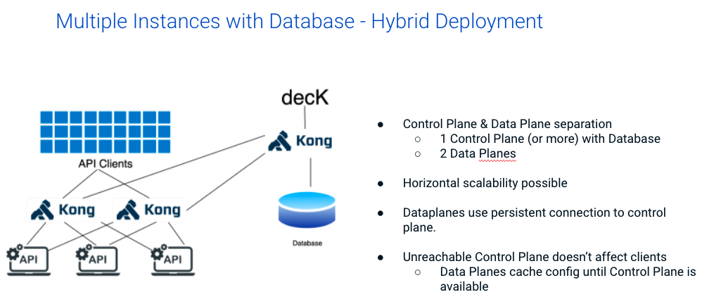

Installing Kong Gateway, Hybrid Mode on Amazon Linux 2 with Terraform
===========================================================

This example stands up two Amazon Linux 2 instances and a single postres (RDS) instance with Terraform.  From there, a procedure is given to install Kong gateway running in hybrid mode, with separate control and data planes.




## Prerequisites
1. AWS Credentials (Access Key ID and Secret Access Key)
2. AWS Key Pair for SSH
3. Terraform CLI

## Procedure

1. Via the CLI, login to AWS using `aws configure`.
2. Open `tf/main.tf` and update the key_name to match your AWS keypair (SSH)
3. In the same file, update the Tags/Name to something unique that identifies you.
4. Via the CLI, run the following Terraform commands to standup your Linux and Postgres instances:

```bash
terraform init
terraform apply
```

5. Once terraform has stoodup the instances, SSH via the shell using the `public_ip` output:

```bash
ssh -i /path/to/<SSH keypair>.pem ec2-user@<public_ip>
```

## Setup Control Plan instance

1. Setup the database connection from the control plane EC2 instance using the following commands (password will be `Abcd1234`):

```bash
sudo amazon-linux-extras install postgresql13
psql --host <enter-rds-hostname> --port 5432 --username=postgres
psql -c "CREATE USER kong;"
psql -c "GRANT kong TO postgres;"
psql -c "CREATE DATABASE kong OWNER kong;"
psql -c "ALTER USER kong WITH PASSWORD 'kong';"
exit
```

2. Via the regular shell, install Kong:

```bash
curl -Lo kong-enterprise-edition-2.8.1.0.amzn2.noarch.rpm "https://download.konghq.com/gateway-2.x-amazonlinux-2/Packages/k/kong-enterprise-edition-2.8.1.0.amzn2.noarch.rpm"
sudo yum install kong-enterprise-edition-2.8.1.0.amzn2.noarch.rpm
sudo chmod -R 777 /usr/local/kong
```

3.  scp over the `kong/` directory to EC2 

4. In `cp-example.conf`, update the pg_host and pg_password to match your credentials.

5. Copy certs over to `/var/certs`:

```bash
sudo cp -r certs/ /var/certs
```

6. Run the following commands to setup the database and start the Kong control plane:

```bash
kong migrations bootstrap -c cp-example.conf 
kong start -c cp-example.conf
```

7. Test the admin API locally on ec2 using `curl`:

```bash
curl -i -X GET --url http://localhost:8001/services
```

8. Test the Management GUI via the browser: `http://<public_ip>:8002/overview`

9. Via the CLI, apply your Enterprise license:

```bash
curl -i -X POST http://<hostname>:8001/licenses \
  -d payload='<insert license>'
```

10. Restart kong:

```bash
kong stop
kong start -c cp-example.conf
```

## Setup Data Plan instance

1. Via the CLI, ssh to the `SimonGreen_DP_AmznLinux2` instance 

2. Via the regular shell, install Kong:

```bash
curl -Lo kong-enterprise-edition-2.8.1.0.amzn2.noarch.rpm "https://download.konghq.com/gateway-2.x-amazonlinux-2/Packages/k/kong-enterprise-edition-2.8.1.0.amzn2.noarch.rpm"
sudo yum install kong-enterprise-edition-2.8.1.0.amzn2.noarch.rpm
sudo chmod -R 777 /usr/local/kong
```

3.  scp over the `kong/` directory to EC2 

4. Update `cluster_control_plane` and `cluster_telemetary_endpoint` with the external IP of you CP instance.

5. Copy certs over to `/var/certs`:

```bash
sudo cp -r certs/ /var/certs
```

6. Run the following commands to start the Kong data plane:

```bash
kong start -c dp-example.conf
```

7. From the CP instance shell, test the admin API locally on ec2 using `curl` to view the dataplane has conneted:

```bash
curl -i -X GET http://localhost:8001/clustering/data-planes
```

8. Test the DP proxy via your dev machine browser: `curl http://<dp public IP>:8000`